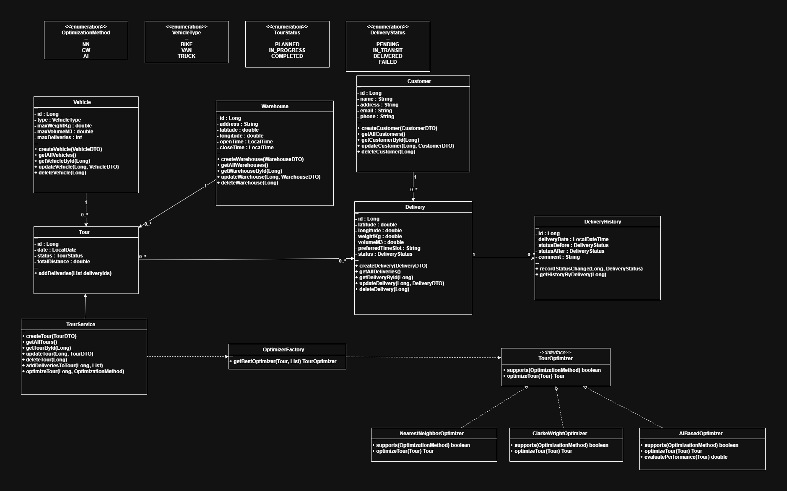
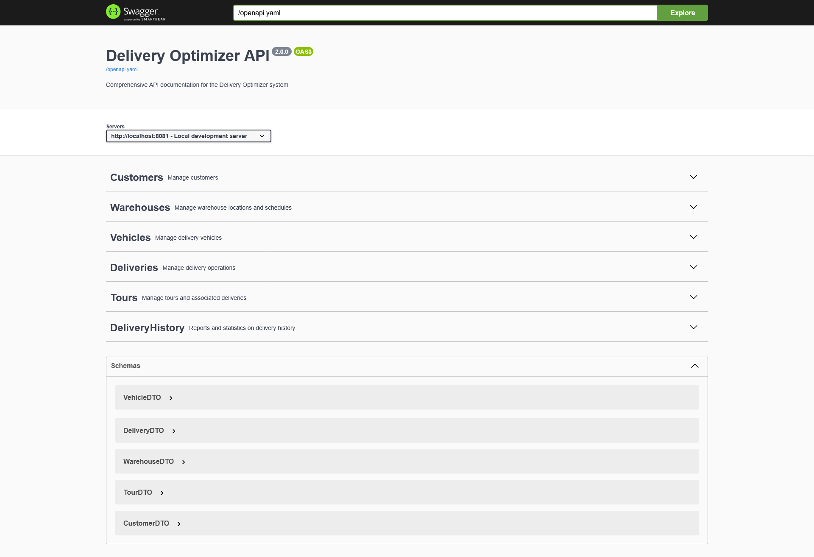

# 🚚 Delivery Tour Optimization System – **Version 2.0**

## 📌 Project Description

This project is a **Spring Boot 3 web application** developed in **Java 17+** that manages and optimizes delivery tours for a logistics company.
It is the evolution of the first version, with a **refactored architecture**, **new entities**, **Liquibase database migrations**, and an **AI-assisted optimization engine**.

The system aims to reduce travel distance and fuel consumption by dynamically selecting the **fastest optimization strategy** among:

* 🧭 **Nearest Neighbor (NN)**
* ⚙️ **Clarke & Wright (CW)**
* 🤖 **AI-Based Optimizer** (Spring AI-powered)

The architecture now respects the **Open/Closed Principle (OCP)** — new optimizers can be added without modifying the existing service logic.

---

## 🎯 Main Objectives

* Manage a **heterogeneous fleet** (Bike, Van, Truck) with constraints on capacity, volume, and delivery count
* Plan and optimize **delivery tours automatically**
* Dynamically choose the **fastest optimizer** at runtime
* Keep a **history of delivery status changes**
* Add **Customer management** with link to deliveries
* Provide multi-environment configurations (`dev`, `qa`)
* Support **Liquibase migrations**, **YAML configs**, and **AI optimization**

---

## 🔗 Useful Links

* 📂 [GitHub Repository](https://github.com/Ibrahim-Nidam/Delivery_Optimizer_AI.git)
* 📝 [Jira Board](https://ibrahimnidam-22.atlassian.net/jira/software/projects/DOA/boards/232/backlog?atlOrigin=eyJpIjoiNTkyOTI2NjI0OWE1NDVhMDk5MDAzN2NhYzkxODM1MDAiLCJwIjoiaiJ9)

---

## 🛠️ Technologies Used

* **Java 17+**
* **Spring Boot 3**
* **Spring Data JPA**
* **Liquibase** for DB versioning
* **Spring AI** for intelligent optimization
* **PostgreSQL** (QA) / **H2** (Dev)
* **YAML-based configuration**
* **MapStruct** for DTO mapping
* **REST API** + **GraphQL (optional)**
* **Swagger UI** for API documentation
* **JUnit 5 & Mockito** for testing
* **SonarLint** for static analysis
* **Docker (optional)** for containerized deployment
* **ESP32 Integration (optional)** for network monitoring

---

## 🧩 New Functionalities in Version 2.0

✅ Refactored entities and DTOs with stronger validation

✅ New entities: `Customer` and `DeliveryHistory`

✅ New **AI-based optimizer** integrated with Spring AI

✅ **OptimizerFactory** auto-selects best-performing optimizer

✅ **Liquibase** changelogs for schema versioning

✅ Environment profiles:

* `dev` → H2 Database
* `qa` → PostgreSQL
  
  ✅ Configuration moved from `.properties` to `.yml`
  
  ✅ Optional **GraphQL API** for advanced querying
  
  ✅ Optional **Docker & ESP32 Monitoring** modules

---

## 📂 Project Structure

```
delivery-optimizer-v2/
│
├── pom.xml
├── README.md
├── .gitignore
├── .gitattributes
│
├── src/
│   ├── main/
│   │   ├── java/com/deliveryoptimizer/
│   │   │   ├── DeliveryOptimizerApplication.java
│   │   │   ├── annotation/
│   │   │   │   └── OptimizerType.java
│   │   │   ├── config/
│   │   │   │   ├── AppConfig.java
│   │   │   │   ├── OpenApiConfig.java
│   │   │   │   └── OptimizerProperties.java
│   │   │   ├── controller/
│   │   │   │   ├── CustomerController.java
│   │   │   │   ├── DeliveryController.java
│   │   │   │   ├── DeliveryHistoryController.java
│   │   │   │   ├── TourController.java
│   │   │   │   ├── VehicleController.java
│   │   │   │   └── WarehouseController.java
│   │   │   ├── dto/
│   │   │   │   ├── CustomerDTO.java
│   │   │   │   ├── DeliveryDTO.java
│   │   │   │   ├── DeliveryHistoryDTO.java
│   │   │   │   ├── DeliveryHistoryReportDTO.java
│   │   │   │   ├── VehicleDTO.java
│   │   │   │   ├── WarehouseDTO.java
│   │   │   │   └── TourDTO.java
│   │   │   ├── mapper/
│   │   │   │   ├── CustomerMapper.java
│   │   │   │   ├── DeliveryMapper.java
│   │   │   │   ├── DeliveryHistoryMapper.java
│   │   │   │   ├── TourMapper.java
│   │   │   │   ├── VehicleMapper.java
│   │   │   │   └── WarehouseMapper.java
│   │   │   ├── model/
│   │   │   │   ├── Customer.java
│   │   │   │   ├── Delivery.java
│   │   │   │   ├── DeliveryHistory.java
│   │   │   │   ├── Tour.java
│   │   │   │   ├── Vehicle.java
│   │   │   │   ├── Warehouse.java
│   │   │   │   └── enums/
│   │   │   │       ├── DeliveryStatus.java
│   │   │   │       ├── TourStatus.java
│   │   │   │       └── VehicleType.java
│   │   │   ├── repository/
│   │   │   │   ├── CustomerRepository.java
│   │   │   │   ├── DeliveryRepository.java
│   │   │   │   ├── DeliveryHistoryRepository.java
│   │   │   │   ├── TourRepository.java
│   │   │   │   ├── VehicleRepository.java
│   │   │   │   └── WarehouseRepository.java
│   │   │   ├── service/
│   │   │   │   ├── factory/
│   │   │   │   │   └── OptimizerFactory.java
│   │   │   │   ├── impl/
│   │   │   │   │   ├── AIOptimizer.java
│   │   │   │   │   ├── ClarkeWrightOptimizer.java
│   │   │   │   │   ├── NearestNeighborOptimizer.java
│   │   │   │   │   ├── CustomerServiceImpl.java
│   │   │   │   │   ├── DeliveryServiceImpl.java
│   │   │   │   │   ├── DeliveryHistoryServiceImpl.java
│   │   │   │   │   ├── TourServiceImpl.java
│   │   │   │   │   ├── VehicleServiceImpl.java
│   │   │   │   │   └── WarehouseServiceImpl.java
│   │   │   │   └── interfaces/
│   │   │   │       ├── CustomerService.java
│   │   │   │       ├── DeliveryService.java
│   │   │   │       ├── DeliveryHistoryService.java
│   │   │   │       ├── TourService.java
│   │   │   │       ├── VehicleService.java
│   │   │   │       ├── WarehouseService.java
│   │   │   │       └── TourOptimizer.java
│   │   │   ├── util/
│   │   │   │   ├── DistanceCalculator.java
│   │   │   │   ├── TourUtils.java
│   │   │   │   └── AIModelHelper.java
│   │   │   └── ServletInitializer.java
│   │   │
│   │   └── resources/
│   │       ├── application.yml
│   │       ├── application-dev.yml
│   │       ├── application-qa.yml
│   │       ├── logback.xml
│   │       ├── db/
│   │       │   └── changelog/
│   │       │       ├── db.changelog-master.xml
│   │       │       ├── db.changelog-v1.0-initial.xml
│   │       │       └── db.changelog-v2.0-new-entities.xml
│   │       └── static/
│   │           ├── customers.yaml
│   │           ├── deliveries.yaml
│   │           ├── deliveryHistory.yaml
│   │           ├── tours.yaml
│   │           ├── vehicles.yaml
│   │           ├── warehouses.yaml
│   │           └── openapi.yaml
│   │
│   └── test/java/com/deliveryoptimizer/
│       ├── DeliveryOptimizerApplicationTests.java
│       ├── service/ClarkeWrightOptimizerTest.java
│       ├── service/NearestNeighborOptimizerTest.java
│       └── util/DistanceCalculatorTest.java
│
├── docs/
│   ├── Delivery_Optimizer_AI.png
│   ├── api-collection.json
│   └── swagger_screenshots/
│       ├── swagger.png
│       └── Endpoints.png
│
└── logs/
    └── app.log

```

---

## ⚙️ Main Features

✅ CRUD management for **Customer**, **Warehouse**, **Vehicle**, **Delivery**, and **Tour**

✅ **DeliveryHistory** tracking (status transitions logged automatically)

✅ Dynamic **OptimizerFactory** — selects best performing algorithm (NN, CW, or AI)

✅ Distance computation from **GPS coordinates**

✅ Profile-based configurations (`dev` → H2, `qa` → PostgreSQL)

✅ **Liquibase** for schema evolution

✅ Optional **GraphQL endpoints**

✅ Optional **Docker** and **ESP32 IoT monitoring** modules

✅ REST API + Swagger Documentation

✅ Unit and Integration Testing

---

## 🧠 Optimizer Architecture (Open/Closed Principle)

| Optimizer                    | Description                             | Strength                 |
| ---------------------------- | --------------------------------------- | ------------------------ |
| **NearestNeighborOptimizer** | Chooses the next closest delivery       | Fast but approximate     |
| **ClarkeWrightOptimizer**    | Merges routes based on distance savings | Balanced and reliable    |
| **AIBasedOptimizer**         | Uses Spring AI to predict optimal route | Adaptive and data-driven |

All implement `TourOptimizer`.
`OptimizerFactory` automatically detects available optimizers and picks the **best-performing one** for each tour dynamically.

---

## 📊 UML Class Diagram



---

## 📸 Application ScreenShots




---


## 🧪 Run & Test

```bash
  mvn spring-boot:run
```

**Swagger UI:**
👉 [http://localhost:8081/swagger-ui/index.html](http://localhost:8081/swagger-ui/index.html)

**Postman Collection:**
Import `/docs/api-collection.json`

**Run tests:**

```bash
mvn test
```

---

## ⚡ Example API Endpoints

| Entity                          | Base URL          | Methods                |
| ------------------------------- | ----------------- | ---------------------- |
| `/api/customers`                | Manage customers  | GET, POST, PUT, DELETE |
| `/api/deliveries`               | Manage deliveries | GET, POST, PUT, DELETE |
| `/api/warehouses`               | Manage warehouses | GET, POST, PUT, DELETE |
| `/api/vehicles`                 | Manage vehicles   | GET, POST, PUT, DELETE |
| `/api/tours`                    | Manage tours      | GET, POST, PUT, DELETE |
| `/api/tours/optimize?method=ai` | AI optimization   | GET                    |

---

## 📅 Project Management

* **Duration:** 03/11/2025 → 11/11/2025
* **Type:** Individual
* **Version:** 2.0
* **Tools:** GitHub, Jira, SonarLint, Postman, Docker, Spring AI

---